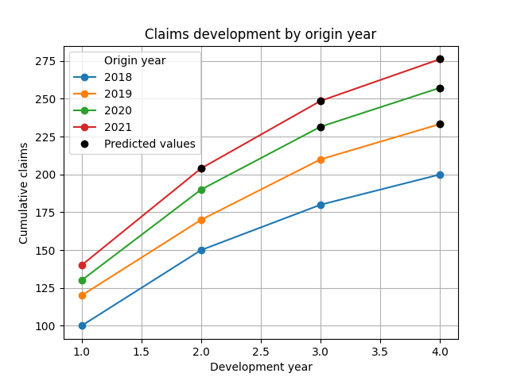

Detta projekt skapar en fiktiv skadetriangel, beräknar utvecklingsfaktorer med chain-ladder-metoden för att prediktera okända värden och visualiserar resultatet med ett linjediagram som tydligt markerar prediktionerna.

Linjediagram som visar skadeutveckling för varje ursprungsår. Svarta prickar markerar predikterade värden.
